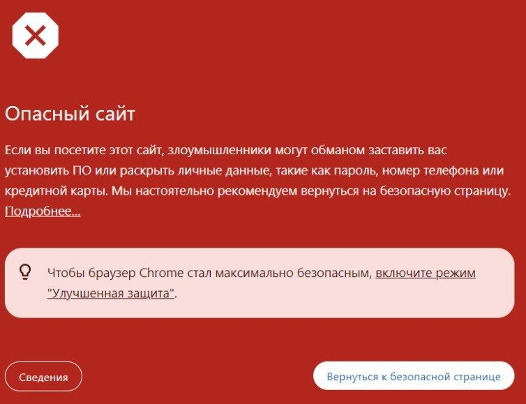

# on-cloak-nano
 &lt;ON&gt; CLOAK Nano - простая кло на PHP для защиты от Google Safe Browsing и прочих ботов/кровлеров

# Что такое блокировка Google Safe Browser?
Вот такой банер выскакивает при попытке перейти на заблокированный сайт у **всех пользователей современных браузеров**:
 

# Системные требования
- Хостинг с поддержкой PHP7.2+
- Доступ к файлам сайта

# Как использовать?
0. Переименовываем index-файл сайта, который надо заклоачить в `index.php`, если он на HTML;
1. Вставляем код из `index.php` в **самом верху index-файла**;
2. Берём HTML-вайт (его вы <a href="https://t.me/ontech_support" target="_blank">можете заказать у нас</a> 😉) и переименовываем его index-файл в `w.html`;
3. Льём получившийся вайт в ту же папку, что и сам заклоаченный сайт. Убеждаемся, что **файлы вайта не мешают файлам сайта**; 
4. Готово!